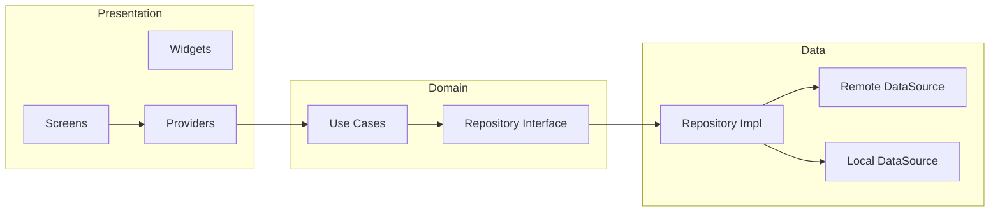

# Code Review – Posts App (Flutter PoC)

This document supports a structured code review with the client. Use the sections below to walk through the architecture, design decisions, and quality checks.

---

## 1. Project Overview

| Item | Description |
|------|-------------|
| **App** | Posts App – fetches posts and users from JSONPlaceholder, list view (Instagram-like), filter by title, persistent bookmarks |
| **Stack** | Flutter (stable), Dart 3.6+, Riverpod, Dio, Freezed, go_router, SharedPreferences |
| **Scope** | Proof of concept; no auth; public API only |

---

## 2. Architecture

### 2.1 High-level flow



**Data flow:** UI → Provider (StateNotifier) → Use cases → Repository → Datasources.

### 2.2 Folder structure

```
lib/
├── main.dart                    # Entry: ProviderScope, SharedPreferences override, MyApp
├── core/                        # Shared infrastructure
│   ├── constants/               # API URLs, storage keys
│   ├── mixins/                  # Reusable behavior (loading, snackbar, validation)
│   ├── network/                 # Dio client, ApiResult
│   ├── router/                  # go_router config, route paths
│   ├── theme/                   # Colors, dimensions, text styles, light/dark theme
│   ├── usecases/                # Base UseCase / UseCaseNoParams
│   ├── utils/                   # AppLogger
│   └── widgets/                 # Shared UI (e.g. LoadingView)
└── features/
    └── posts/
        ├── data/                # Implementation details
        │   ├── datasources/     # Remote (Dio), Local (SharedPreferences)
        │   ├── models/          # Freezed + json_serializable (PostModel, UserModel)
        │   └── repositories/    # PostRepositoryImpl
        ├── domain/              # Business logic, no Flutter
        │   ├── entities/        # Post, User
        │   ├── repositories/    # PostRepository interface
        │   └── usecases/        # GetPosts, GetUsers, GetBookmarks, Add/RemoveBookmark
        └── presentation/
            ├── providers/       # Riverpod providers, PostsNotifier, PostsState
            ├── screens/         # PostsScreen, BookmarksScreen, PostDetailScreen
            └── widgets/         # PostCard, PostSearchBar, EmptyState, ErrorView, AuthorRow, etc.
```

### 2.3 Review checklist – Structure

- [ ] Feature-first layout (posts feature contains data/domain/presentation)
- [ ] Domain has no dependency on Flutter or data layer
- [ ] Data layer depends on domain (entities, repository interface)
- [ ] Presentation depends on domain (entities, use cases) and injects repository via providers
- [ ] Core holds only shared code (theme, router, network, utils, shared widgets)

---

## 3. API and User Handling

### 3.1 Endpoints

- **Base:** `https://jsonplaceholder.typicode.com`
- **Used:** `GET /posts`, `GET /users`

### 3.2 Strategy

- Posts and users are fetched **in parallel** via `Future.wait` in `PostsNotifier.fetchPosts()`.
- A single `userId → User` map is built from the users list.
- Each post is combined with `userMap[post.userId]` into `PostWithUser`; author name is `user?.name ?? 'Unknown Author'`.
- **No N+1:** one request for posts, one for users; resolution is in memory.

### 3.3 Review checklist – API

- [ ] Base URL and endpoints centralized (e.g. `ApiConstants`)
- [ ] Dio used with base URL, timeouts, and error handling (e.g. `_handleDioError`)
- [ ] User resolution done in app (map lookup), not by extra API calls
- [ ] Loading and error states handled in UI (loading indicator, error view with retry)

---

## 4. State Management

### 4.1 Choices

- **Riverpod** for DI and state.
- **StateNotifier + Freezed** for posts feature: `PostsState` (status, posts, bookmarkedIds, searchQuery, showBookmarksOnly, errorMessage).
- **Derived state:** `filteredPosts` (by title + optional bookmarks filter) and `bookmarkedPosts` are getters on state; no duplicate list in memory.

### 4.2 Review checklist – State

- [ ] Single source of truth for posts and bookmarks (PostsNotifier / PostsState)
- [ ] Filtering and bookmark list are derived (getters), not stored separately
- [ ] Status flow: initial → loading → loaded | error
- [ ] Bookmark toggle updates both persistence (SharedPreferences) and in-memory state

---

## 5. Bookmarks (Persistence)

- Bookmarked **post IDs** stored in SharedPreferences (JSON array).
- Loaded at app start together with posts; applied to `PostWithUser.isBookmarked`.
- Add/remove bookmark: update SharedPreferences and then update state so UI stays in sync.

### Review checklist – Bookmarks

- [ ] Persistence key in one place (e.g. `StorageConstants`)
- [ ] No sensitive data in bookmarks (only IDs)
- [ ] Bookmarked state visible in list (e.g. icon + “Saved”) and in Bookmarks screen / filter

---

## 6. Testing

- **Unit tests:** PostsState (filteredPosts, bookmarkedPosts), PostWithUser (authorName); use cases (mocked repository); PostRepositoryImpl (mocked datasources); PostsNotifier (mocked use cases, success/error, search, bookmark toggle).
- **Widget test:** App smoke test with overrides (SharedPreferences, FakePostRemoteDataSource) so no real network; asserts “Posts” in app bar.
- **Logger:** `AppLogger.level = Level.off` in notifier tests to avoid noisy error logs from intentional failures.

### Review checklist – Testing

- [ ] Domain/state logic covered (state getters, use cases, repository impl)
- [ ] Notifier behavior covered (fetch, error, search, bookmarks)
- [ ] No real API calls in tests (mocks / fakes)
- [ ] Tests run with `flutter test` and pass

---

## 7. UI / UX

- **Screens:** Posts (list + search + bookmark filter), Bookmarks, Post detail.
- **Reusable widgets:** PostCard, PostSearchBar, EmptyState, ErrorView, LoadingView, AuthorRow, PostImagePlaceholder.
- **Theme:** Centralized (AppTheme, AppDimens, AppColors); Material 3; light/dark.
- **Behavior:** Pull-to-refresh, retry on error, clear search, “Show All” for bookmark filter.

### Review checklist – UI

- [ ] Loading and error states have clear UI (LoadingView, ErrorView)
- [ ] Empty states (no results, no bookmarks) are explicit (EmptyState)
- [ ] Layout and spacing use shared constants (AppDimens / AppPadding)
- [ ] Navigation and routes centralized (go_router, AppRoutes)

---

## 8. Code Quality

- **Immutability:** Freezed for entities, models, and state.
- **DI:** Riverpod providers for Dio, SharedPreferences, datasources, repository, use cases, notifier.
- **Separation:** Domain has no Flutter; data implements domain interfaces; presentation calls use cases only.
- **Naming:** Consistent (e.g. *DataSource, *Repository, *UseCase, *Provider, *State).

### Review checklist – Quality

- [x] No business logic in UI (logic in notifier / use cases / repository)
- [x] Async errors handled (try/catch, error state, user-facing message)
- [x] Lints/analyzer: `flutter analyze` clean

---

## 9. Review Notes and Decisions

Use this section during the call to capture client feedback and agreed decisions.

| Topic | Notes / Decision |
|-------|------------------|
| Architecture | |
| API / user handling | |
| State / bookmarks | |
| Testing | |
| UI / UX | |
| Follow-ups | |

---

## 10. References

- **Run the app:** See [README.md](README.md#how-to-run).
- **Architecture summary:** See [README.md](README.md#architecture).
